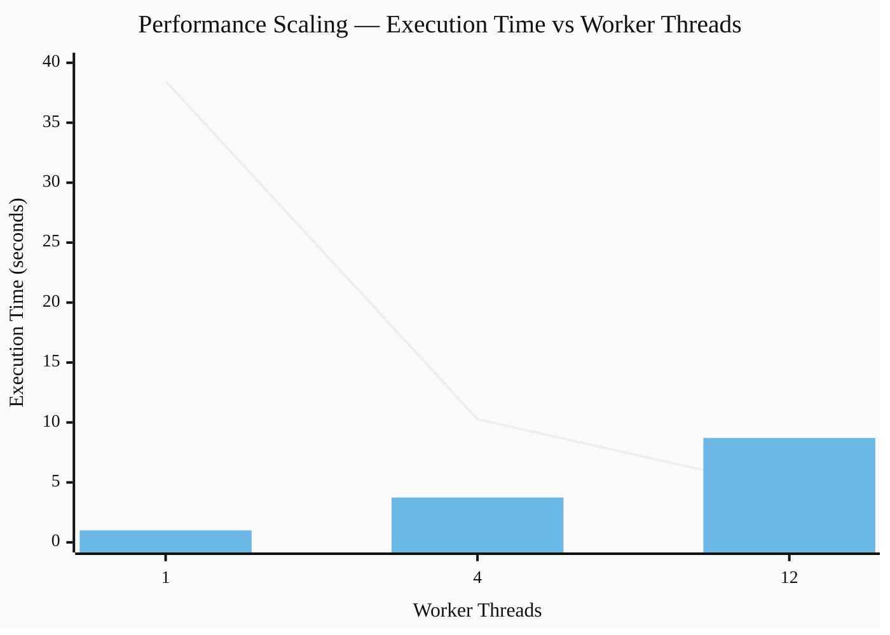

### curl command to test the response time

```curl
time curl --get http://localhost:3000/blocking
```

### test results

| Test Scenario                | Implementation File                              | Worker Thread Count | Real Time (seconds) |
| :--------------------------- | :----------------------------------------------- | :------------------ | :------------------ |
| **Original (Baseline)**      | [`./index.js`](./index.js)                       | 1                   | 38.474              |
| **Multi-threaded**           | [`./index-12-workers.js`](./index-12-workers.js) | 4                   | 10.275              |
| **Optimized Multi-threaded** | [`./index-12-workers.js`](./index-12-workers.js) | 12                  | 4.417               |

Execution Time (s)
1 thread  (38.474s) | ████████████████████████████████████████████  (38.474)
4 threads (10.275s) | ██████████                                    (10.275)
12 threads (4.417s) | ████                                          (4.417)

Speedup (relative to 1 thread)
1 thread  : 1.000 | █
4 threads : 3.743 | ███████████
12 threads: 8.712 | █████████████████████████

# ⚙️ Performance Scaling Chart

This chart compares **execution time** and **speedup** as the number of worker threads increases.



```js
const THREAD_COUNT = 12; //change this line
```
